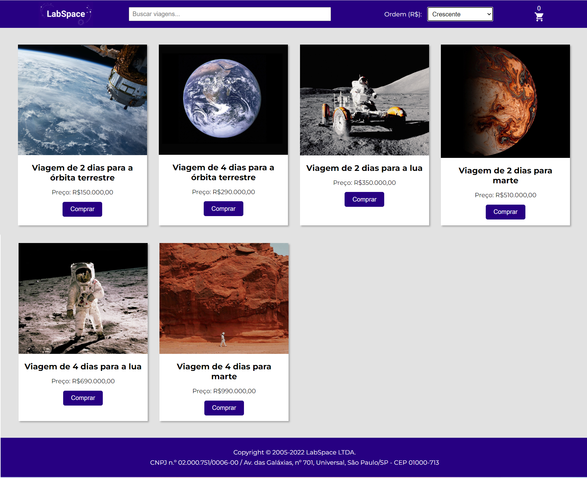
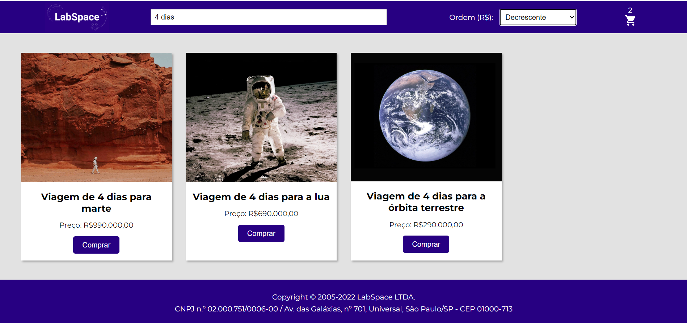
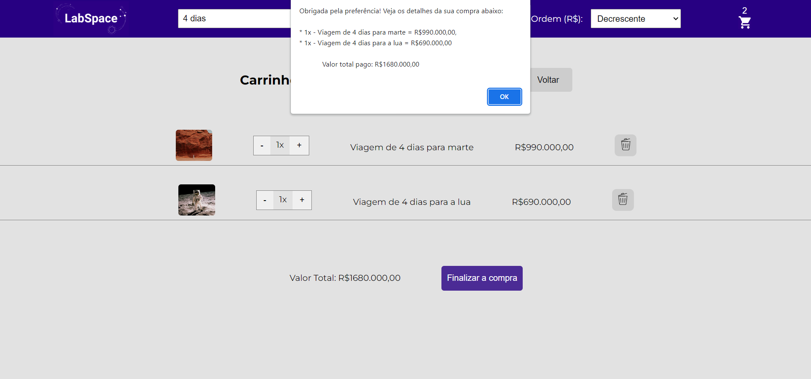
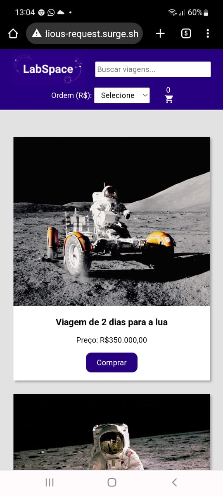
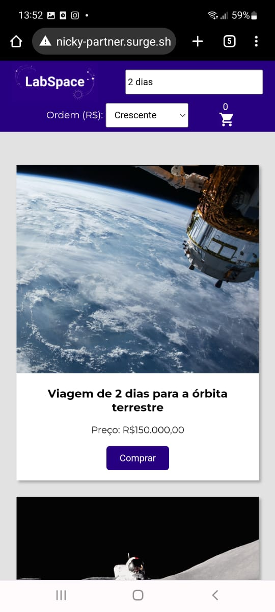
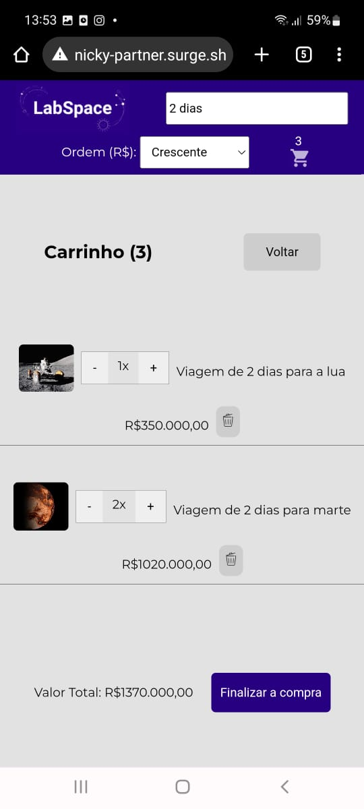

# e-commerce LabEcommerce

This is an exercise to practice some of the following technologies:
* JavaScript
* HTML
* Styled-components
* React.js

Data was consumed from an API Rest developed by me. The link of the github repository is: https://github.com/francinehahn/ecommerce-backend

## Functionalities
* To filter the products by name;
* To order the products by price (ascending and descending order);
* To visualize the name, the price and the image os the items;
* To add the product to cart;
* To see the number os products added to cart;
* To delete the products added to cart;
* To increse and decrease the product units in the cart;
* To visualize the total value of products added to cart;
* To see all the items added to cart even after loading the page;
* To complete an order and receive a message with a list of all the purchased items and the total value of the order;
* After completing the order, the shopping cart is emptied; 
* The project is responsive to all screen sizes.

## Link Surge

## Images

### Desktop version

 

 

 

 

### Mobile version

 

 

 

